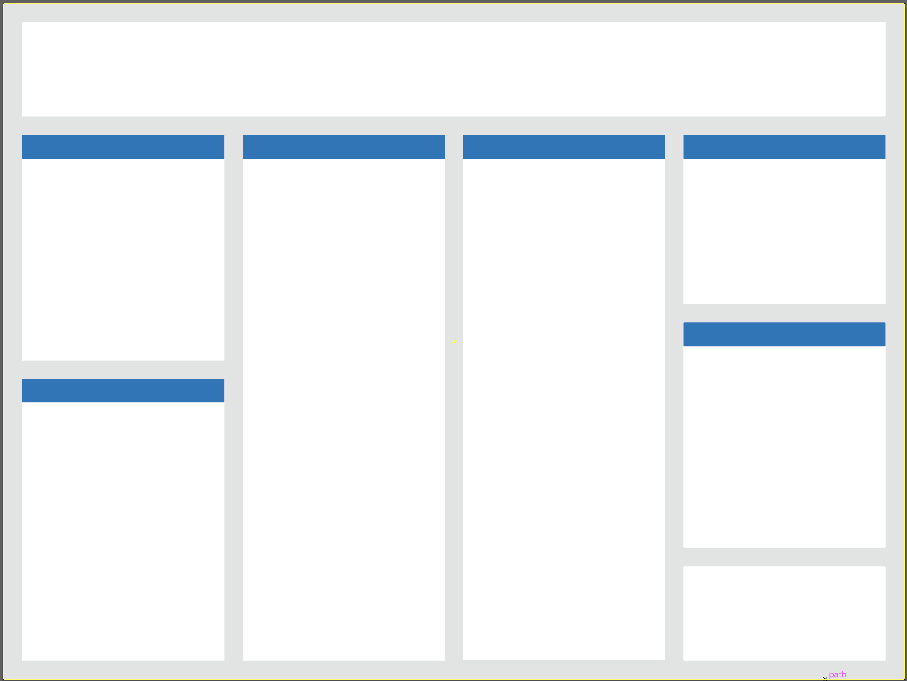
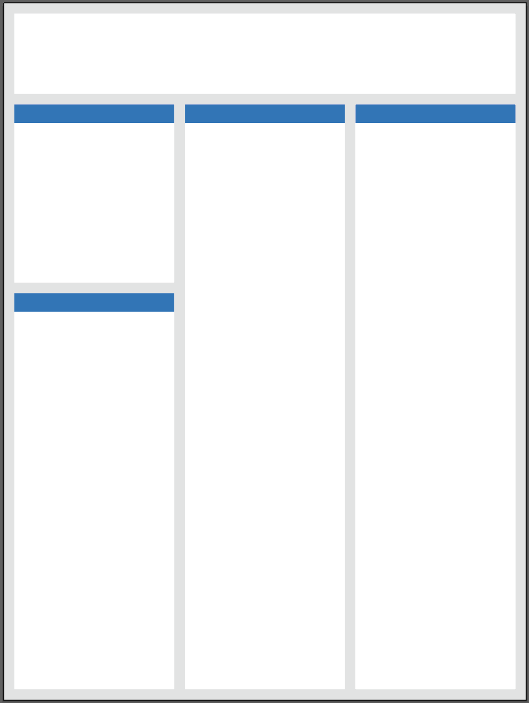
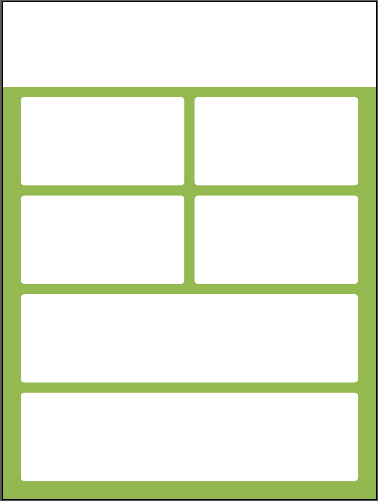

For help with editing these templates, please refer to [The guide on using the Master Slide in Microsoft PowerPoint](Using%20a%20Microsoft%20PowerPoint%20Poster%20Template.pdf "Using a Microsoft PowerPoint Poster Template")

# Style 1
### Horizontal

### Vertical

### Square

# Style 2
### Vertical

### Square

