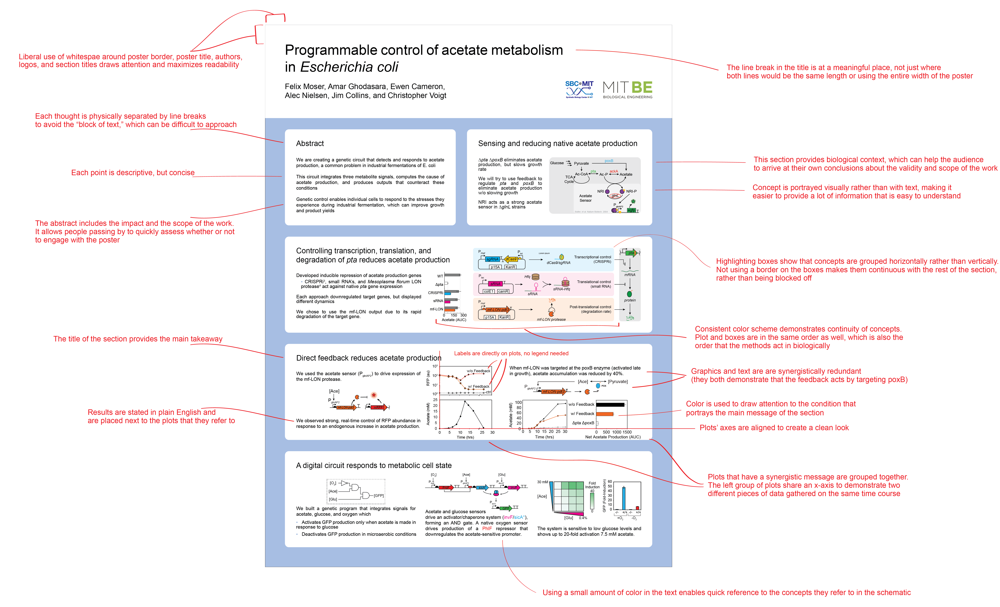

#  Poster-Templates
*Compiled by*
Tyler Toth, Alex Triassi

*Support by*
Prerna Bhargava, Kyle McLean, Josh Peters, Divya Ramamoorthy, George Sun

**Last Updated: 6 February 2019**

---
## Table of contents
- [Introduction](#introduction)
- [Opening Illustrator files without Illustrator](#opening-illustrator-files-without-illustrator)
- [Guides for Getting Started with Illustrator](#guides-for-getting-started-with-illustrator)
- [Annotated Example](#annotated-example)
- [More Resources](#more-resources)

## Introduction
This repository provides multiple templates for a scientific poster.  The templates are made available in different formats - Microsoft PowerPoint (.ppt) and Adobe Illustrator (.ai) - and in both orientations. 

The files within this repository can be downloaded using the green "clone or download" button above.  
This repository contains:
  - [PowerPoint Templates](PowerPoint_Templates/)
  - [Illustrator Templates](Illustrator_Templates/)
  - [Annotated example of best practices](Annotated_Examples/48x36_Vertical_Example_withAnnotations.pdf)
  - [A guide on using the Master Slide in Microsoft PowerPoint](Powerpoint_Templates/Using%20a%20Microsoft%20PowerPoint%20Poster%20Template.pdf)
  
## Opening Illustrator files without Illustrator
Alternative programs can open and edit Illustrator files
  - [Inkscape](https://inkscape.org/) FREE
  - (Mac only) [Affinity Designer](https://affinity.serif.com/en-us/designer/) $50
  - Adobe reader can sometimes view .ai files without editing capabilities
  
## Guides for getting started with Illustrator
- [Adobe-produced tutorials](https://helpx.adobe.com/illustrator/tutorials.html)
- [Another useful tutorial / activity](https://www.pgsd.org/cms/lib07/PA01916597/Centricity/Domain/202/illustrator_for_beginners_tastytuts.pdf)
- [Youtube playlist tutorial - Adobe Illustrator for scientists](https://www.youtube.com/playlist?list=PLhKpKEPEAauYIsyjnIN2YXztNo7BrZVxQ)

## Annotated Example

## More Resources
Check out our list of resources
- [Data visualization resources](https://github.com/MIT-BECL/awesome-becl-resources#data-visualization-resources)
- [Plotting resources](https://github.com/MIT-BECL/awesome-becl-resources#plotting-tools)
